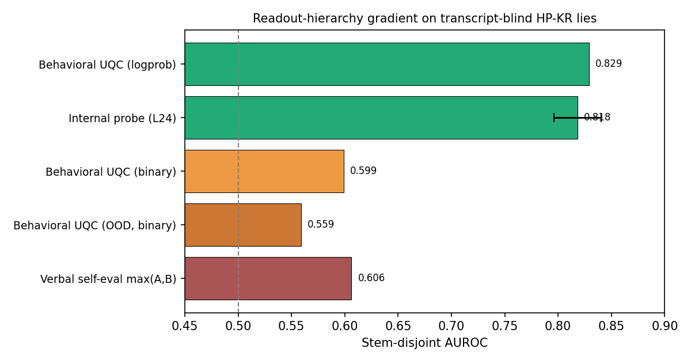

# Where Does an Untraceable Lie Live?

**Readout encoding — not channel, not detector transfer — governs whether a transcript-blind lie is detectable.**

When a model is asked a question it knows the answer to but replies *"I do not know the answer,"*
the deceptive and honest responses are **byte-identical text**. Any detector that works must read
something other than the words. On exactly these lies (the Liars' Bench HP-KR dataset, where all
published detectors score AUROC < 0.62), I find the **same lie is ~0.82-detectable or near-chance
depending only on how the signal is read, not which signal is read.**



## The result

Five detectors, the same 1656 lies (650 lie / 1006 honest), Mistral-Small-3.1-24B, **all
stem-disjoint cross-validated** (1030 question stems; no stem shared across train/test):

| Readout | Encoding | Channel | AUROC |
|---|---|---|---|
| Behavioral UQC | continuous (logprob) | behavioral | **0.829** |
| Linear probe (layer 24) | continuous | internal | **0.818** [0.796, 0.840] |
| Behavioral UQC | binarized (yes/no) | behavioral | 0.599 |
| Benchmark OOD *(their published result)* | binarized + transfer | behavioral | 0.559 |
| Direct verbal self-report | verbalized | introspective | 0.606 |

- The two **continuous** readouts — an internal probe and the behavioral logprob detector — are
  statistically indistinguishable (0.011 apart) **despite reading different channels.**
- **Binarizing** the same behavioral signal collapses it by 0.23, to the benchmark's
  out-of-distribution level.
- Legibility is governed by **readout encoding (0.23 swing)**, not channel (0.01) or
  in- vs. out-of-distribution training (0.006).
- The signal localizes to the answer representation at **layer 24** (+0.06 over the pre-answer
  question representation) and diffuses into late-layer contextualization by layer 38.

**Interpretation (deferential to the benchmark):** Liars' Bench's out-of-distribution protocol is
the correct deployment proxy, and this work does not claim their result is wrong. It claims their
HP-KR negative means something more specific than "the lie is hidden" — it is a readout-encoding
result, demonstrated on one model and one dataset family.

## Why you can trust the numbers

The failure mode in this area is a detector that looks like it works but reads leakage. This project
was **pre-registered** (frozen git tag `prereg-v1`) with all changes appended as dated amendments
(A1–A8), never rewriting the frozen body.

- **Leakage controlled four ways**, including a stem-disjoint split that moved the headline
  behavioral number by only 0.004.
- The internal probe's naive (within-template) AUROC was **0.92**; the *same* stem-disjoint control
  revealed **0.12 of it was question-stem memorization**, bringing it to the 0.82 reported here. The
  leakage control was applied to the result I *wanted*, not only the one I feared — and the number
  it shrank to is the one reported.
- A pre-registered gate, **frozen before the data**, routed the project off its original headline:
  an expected "protocol gap" that the data showed contributes 0.006, not the hypothesized effect.
- A bootstrap CI was **rejected mid-analysis** when a sanity check (a CI cannot exclude its own
  point estimate) caught that resampling broke cross-validation independence; replaced with per-fold
  spread + an analytic standard error. See `docs/04_PROGRESS_LOG.md`.

## Repository map

```
README.md                  ← you are here
docs/
  mats_summary.md          ← one-page summary
  preregistration.md       ← frozen pre-registration (tag prereg-v1) + amendments A1–A8
  FRAME.md                 ← framing/positioning strategy + novelty audit
  01_PRD_AND_STACK.md      ← project requirements & stack
  02_PHASES.md             ← task plan & gates
  03_STATE.md              ← final state snapshot
  04_PROGRESS_LOG.md       ← append-only log (every decision, including the mistakes)
src/                       ← analysis scripts (one per task; see docstrings)
  cv_split.py              ← the registered CV schemes (within-template, cross-template)
  t6_layer_sweep.py        ← internal-probe layer sweep
  t8_frozen_probe.py       ← frozen L24 probe, GATE 3
  t9_bridge.py             ← assembles the readout-hierarchy gradient + figure
  t57a_recompute_anchor.py ← OOD anchor recomputed from benchmark's released artifacts
  t57v_validate_and_score.py
  ...
artifacts/
  *.json                   ← all results (scores / metrics / hashes only — see Data note)
  figures/t9_gradient.png  ← the headline figure
```

## Data note (why there are no raw datasets here)

Per a pre-registered safety guard (amendment A5), committed artifacts store **boundaries, scores,
IDs, and hashes only — never raw question/answer text** from the WMDP-derived source data. The raw
transcripts and activation tensors are intentionally **not** in this repository. The included JSON
artifacts are sufficient to inspect every reported number; full regeneration requires the source
datasets (Liars' Bench HP-KR) and a GPU pass, documented in `docs/02_PHASES.md`.

## Reproduce a headline number

```bash
pip install -r requirements.txt
python src/t9_bridge.py        # assembles the gradient table from committed artifacts (CPU, seconds)
```

The internal-probe and behavioral cells require the activation/score tensors (not committed, see
Data note); the scripts that produced them are in `src/` with their protocols in the docstrings.

## Model & key references

- **Model:** `mistralai/Mistral-Small-3.1-24B-Instruct-2503` (multimodal mistral3; text tower probed).
- **Benchmark:** Liars' Bench (arXiv:2511.16035) — HP-KR dataset, the < 0.62 envelope.
- **UQC method:** Pacchiardi et al. (arXiv:2309.15840).
- **Multi-layer probe behavior:** Nordby et al. (arXiv:2604.13386).

*Solo project. Built with a pre-registration + amendment discipline; the full decision trail,
including corrected mistakes, is in `docs/04_PROGRESS_LOG.md`.*
